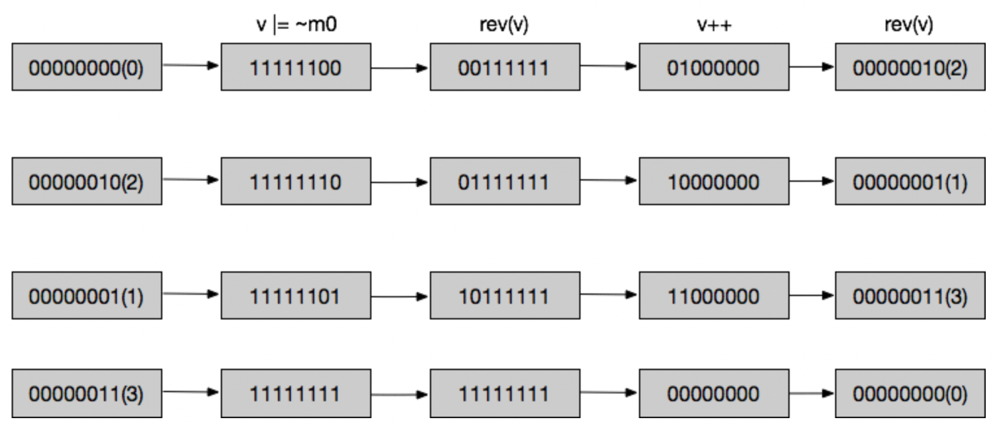

# Set一定是无序的吗-下

## 六、深入探究IntSet原理

### 1、预备知识

#### (1) 大小端字节序转换

在计算机中，数据的存储模式有大端和小端两种模式。


**大端模式（Big endian）**

地址由小向大增加，数据从高位往低位放。这样按照地址递增顺序依次取出的数据，也是按照从高到低的顺序，这种数据处理顺序和字符串处理顺序一致，符合人的阅读顺序。

**小端模式（Little endian）**

地址由小向大增加，数据从低位往高位放。这样按照地址递增顺序依次取出的数据，就会按照从低到高的顺序，这种处理顺序类似于从右向左的处理顺序。

#### (2) Redis小端到大端的转换

为了兼容不同CPU对数据的大端和小端存储，Redis统一使用小端存储，如果当前机器是大端存储，那么Redis就会做一次从大端到小端的转换，否则不转换。转换操作主要通过 `*rev16ifbe`/`*rev32ifbe`/`*rev64ifbe` 几个函数实现。

```c
/* variants of the function doing the actual conversion only if the target host is big endian */
#if (BYTE_ORDER == LITTLE_ENDIAN)
#define memrev16ifbe(p) ((void)(0))
#define memrev32ifbe(p) ((void)(0))
#define memrev64ifbe(p) ((void)(0))
#define intrev16ifbe(v) (v)
#define intrev32ifbe(v) (v)
#define intrev64ifbe(v) (v)
#else
#define memrev16ifbe(p) memrev16(p)
#define memrev32ifbe(p) memrev32(p)
#define memrev64ifbe(p) memrev64(p)
#define intrev16ifbe(v) intrev16(v)
#define intrev32ifbe(v) intrev32(v)
#define intrev64ifbe(v) intrev64(v)
#endif

/* Toggle the 16 bit unsigned integer pointed by *p from little endian to big endian */
void memrev16(void *p) {
    unsigned char *x = p, t;

    t = x[0];
    x[0] = x[1];
    x[1] = t;
}

/* Toggle the 32 bit unsigned integer pointed by *p from little endian to big endian */
void memrev32(void *p) {
    unsigned char *x = p, t;

    t = x[0];
    x[0] = x[3];
    x[3] = t;
    t = x[1];
    x[1] = x[2];
    x[2] = t;
}
```

以`memrev16()`函数为例，它的底层会通过使用一个8位的指针，以8位（1字节）为一个单位，依次交换两边的数据，实现小端和大端之间的转换。


**网络字节序操作**

由于TCP/IP中规定网络字节序统一采用大端的方式，所以在Redis源码中对网络字节序操作时，也会使用大端模式操作。


### 2、IntSet的编码

#### (1) 为什么要区分编码

在上篇文章中讲过，如果Set中都是整型数字且数量少于512个的时候，Redis会使用IntSet结构。让我们估算下内存开销情况 ：

* 假设一个整型数字占8个字节，那么1个Key就会占用`512*8=4096=0.004MB`，10w个Key就会占用400MB
* 假设一个整型数字占4个字节，那么1个Key就会占用`512*4=2048=0.002MB`，10w个Key就会占用200MB
* 假设一个整型数字占2个字节，那么1个Key就会占用`512*2=1024=0.001MB`，10w个Key就会占用100MB

很明显，对于不同的整型数字，使用合理的类型（如short、int、long），几乎可以省去近一半的内存。所以Redis为了减小内存存储，在设计IntSet结构时，对于不同的整型数字使用了不同的编码。

#### (2) 编码类型

IntSet中一共有`int16`/`int32`/`int64`/三种编码类型，分表表示16位、32位、64位整数。

```c
/* Note that these encodings are ordered, so:
 * INTSET_ENC_INT16 < INTSET_ENC_INT32 < INTSET_ENC_INT64. */
#define INTSET_ENC_INT16 (sizeof(int16_t))
#define INTSET_ENC_INT32 (sizeof(int32_t))
#define INTSET_ENC_INT64 (sizeof(int64_t))
```


#### (3) 值的类型定义

如果使用`int16_t`或`int32_t`类型来接收Value值，都会有数据溢出的风险，导致数据错误。所以源码中在对IntSet类型结构进行操作时，值的类型定义都是`int64_t value`，即使用`int64_t`类型来接收任意Value值，再根据当前编码类型进行转换即可。

#### (4) 计算编码

计算编码的方法很简单，只是判断下当前数字所在的整型范围即可。注意`INT32_MIN`和`INT16_MIN`都是负数，而且它们的绝对值是与`INT32_MAX`和`INT16_MAX`一样的。


#### (5) 编码升级

现在考虑一个问题，假设当前选择的编码为int16，如果出现了一个比int16范围大的数字，那么这个数字肯定是无法存下去的。这时就需要对IntSet的contents数组做编码升级操作。

#### (6) 升级过程

在向集合中添加数字的时候，如果当前数字的范围超过当前IntSet的编码范围，就会触发编码升级的操作。


在源码中，`intsetUpgradeAndAdd()`函数完成编码升级过程主要有如下操作 ：

* 根据新插入的Value值计算升级后的编码
* 设置新的编码并调整contents数组大小
* 从后到前升级依次调整contents数组中的元素编码
* 直接把新的Value值插入到contents数组中的首位（负数）或末尾（正数），因为新Value的绝对值一定是数组中最大的。

### 3、核心API精讲

#### (1) intsetNew

创建一个新的IntSet结构，并完成初始化工作。

* 使用`zmalloc()`分配内存，并返回指针
* 初始化IntSet结构时使用int16编码
* 长度初始化为0


**为什么初始编码为int16**

默认情况下，为了最大可能的减少内存占用，编码会先使用最小的类型，即int16

#### (2) intsetAdd

当插入一个元素到IntSet中时，会先计算当前要插入元素的编码，如果大于当前IntSet的编码，则进行编码升级和插入操作。否则只完成元素的插入操作，插入过程主要如下 ：

* 搜索元素是否已存在，存在则直接跳过
* 如果不存在，则返回要插入的位置pos，并调整contents数组的长度，即完成长度加1的操作，以插入新的元素
* 从pos位置开始的元素都整体向后（右）移动一个单元，之后再把元素插入到空闲出来的pos位置上
* 至此，插入操作结束


#### (3) intsetRemove

当移除IntSet中的一个元素时，会巧妙的先比较当前IntSet编码和移除元素的编码，如果小于则说明一定不存在于contents数组中，否则才会进行搜素。

* 搜素到元素所在的位置pos
* 从pos+1位置开始的元素都整体前前（左）移动一个单元，这样pos位置的元素就被覆盖了，达到了删除的效果
* 由于左移动后空出了一个单元，所以最后会调整contents数组的长度，即完成长度减1的操作
* 至此，删除操作结束


#### (4) intsetMoveTail

由于IntSet结构的插入和删除操作，需要涉及到一段连续contents单元的整体移动，所以`intsetMoveTail()`函数会主要使用`memmove()`库函数实现一段连续contents单元的整体移动。


**插入元素**

当插入元素时，内存空间的移动如图所示


**删除元素**

当删除元素时，内存空间的移动如图所示


#### (5) intsetSearch

查找IntSet中的元素时，主要使用二分法查找，并找到元素要插入的位置。


## 七、IntSet结构的优势

从实际上看，IntSet相比于HashTable主要具有如下优势。

### 1、类型简单

HashTable结构不但需要维护一个复杂的dict结构，还需要处理扩容问题。而IntSet的核心只需要维护一个简单的contents数组即可。

### 2、节省内存空间

IntSet结构不但只有contents、encoding、length三个属性，而且还针对不同范围的整型数字设计了不同的编码处理。而HashTable复杂的dict结构，在同等量级的数据下，会多占用30%甚至更多的内存空间。

### 3、综合性能乐观

由于contents是一个有序的数组，在查找时使用二分算法（O(logN)），虽然慢于HashTable的常数级查找，但IntSet结构在内存占用和维护上是优于HashTable的。所以综合性能十分乐观。

## 八、SScan底层原理

### 1、SScan命令介绍

大Key删除问题是Redis常见问题之一，由于直接使用`DEL`命令删除可能会导致Redis严重阻塞，所以Redis为不同类型的Key都提供了一种渐进式的删除方案。SScan就是针对SET类型的渐进式删除命令。

它的命令格式为`sscan key cursor [MATCH pattern] [COUNT count]`

* `cursor` ：迭代成员的起始下标
* `match pattern` ：匹配成员
* `COUNT count` ：返回的数量

#### (1) 使用例子

如下示例，只需要非常简单的`sscan key 0 match * count 3`命令便可以迭代出key中所有的元素。


在上面的示例中，我们选择了返回所有的元素，那么如果我们只选择返回部分元素，会发生什么呢 ？

**IntSet的情况**

如下图在一个Key中加入15个数字后（Redis会使用IntSet存储），使用sscan命令，预期只会返回5个元素。可是为什么实际它却返回了全部的元素 ？


**HashTable的情况**

如下图在一个Key中加入15个字符后（Redis会使用HashTable存储），使用sscan命令，预期返回5个元素。实际也返回了5个


#### (2) 提出问题

通过上面的使用例子了解sscan命令使用的同时，心中也出现了一个疑问。为什么`COUNT`这个参数只针对于HashTable结构有效，而对于IntSet结构则无实质性作用呢 ？

### 2、从源码看执行过程

在源码中，SSCAN命令真正实现是在`scanGenericCommand()`函数中，其实这个函数不止实现了Set类型的Scan，也实现了Hash、ZSET类型的Scan


在`scanGenericCommand()`函数中，主要有3个操作过程组成

#### (1) 解析命令参数

当服务端接收到sscan命令时，会先对它的命令格式进行检查，语法正确后，才会继续向下进行，否则会使用`addReplyErrorObject(c,shared.syntaxerr);`通知客户端语法错误。


#### (2) 迭代整个集合

由于`scanGenericCommand()`函数实现了Hash、Set、ZSet三种类型的迭代，所以在源码中，首先会先判断当前集合是否是HashTable，如果是的话就会以HashTable的方式进行渐进式的迭代，否则直接返回所有的元素。


而对于HashTable的迭代，主要由`dictScan()`函数实现，每次调用完`dictScan()`函数后，它都会返回一个下次迭代的游标cursor，并把迭代到的成员添加到`keys`指针中，当迭代完成或`keys`指针长度超过count时则停止迭代。当然为了性能考虑，Redis只会允许进行`maxiterations=count*10`次的最大迭代次数。


#### (3) 过滤迭代后的元素

在第2步迭代整个集合完成后，会把所有迭代到的元素添加至`keys`中，下面Redis会遍历整个`keys`，实现对元素的进一步过滤。

* 移除掉不符合`match pattern`格式的元素
* 移除掉过期的元素
* ……


### 3、IntSet类型如何进行SScan

在源码注释中有这样的一段话，意思是对于listpack、IntSet这种数据结构，是可以确定它的数量级是很小的，所以SScan命令会直接返回它所有的成员。


在下面这段代码中，发现如果是IntSet类型，确实是会直接迭代完集合中所有的元素。那么为什么Redis要返回所有的元素，而不只返回`COUNT`参数要求的数量呢 ？原因很简单，对于这种数量级很小的集合，Redis为了提高性能就不会使用`COUNT`参数。


### 4、HashTable类型如何进行SScan

对于HashTable的遍历，其实主要就是对它的buckets数组进行遍历。如果只是使用简单的根据index下标递增的方式依次遍历，那么一旦此HashTable处于rehash过程中，可能就会出现重复遍历元素和遍历到已删除元素的问题。


所以在最核心的`dictScan()`函数中，它并不会以一种顺序遍历的方式，遍历完所有的bucket，而是以一种看起来无序，但是又有一定规律的方式把整个buckets遍历完成，它就是`反向二进制迭代算法`。


### 5、反向二进制迭代算法

在源码中，反向二进制迭代主要通过如下代码实现

```c
/* Set unmasked bits so incrementing the reversed cursor
* operates on the masked bits */
v |= ~m0;  // 将游标v的unmarsked 比特都置为1

/* Increment the reverse cursor */
v = rev(v); // 反转v
v++; // v自增1
v = rev(v); // 再次反转，得到下一个游标值
```

下面通过一个简单的例子，来看下标v在实际操作中的变化过程。



关于Redis反向二进制算法的更多讨论，可以[查看这里](https://github.com/redis/redis/pull/579/files)

## 九、问题解答

### 1、Redis Set是否有序

Set集合的定义是无序的，但是Redis底层做了优化，当元素都是整型且不超过512个的时候，会使用IntSet结构，而IntSet结构是有序的。一旦打破这个规则，Redis便会使用Hash结构，这时Set就不再是一个有序的结构了。

### 2、IntSet的有序是指什么

IntSet的有序指的是它底层的contents数组是按照升序排列的。注意不是插入顺序，也不是降序，而是升序 ！


### 3、实际业务中是否应该使用IntSet结构

可能在有些时候，我们会非常明确当前业务场景下是可以用IntSet结构的，但是还是要谨慎使用，或者不使用。因为Redis只是为了优化自身的存储，为Set类型提供了这样的一个特性（IntSet结构），而对于我们这些业务使用方来说，一旦选择使用这样的特性，可能就埋下了定时炸弹。

* 如果业务需要迁移到云上，云上的第三方Redis服务很可能不兼容这种IntSet结构，那么必会引起业务错误
* 很多时候业务场景是很难确定规模的，一旦超出数量的时候，也会引起不必要的麻烦

## 十、完结

至此，《从实践中探究Redis原理》中的Set类型系列文章已经结束，如有问题欢迎评论指出，感谢阅读。
